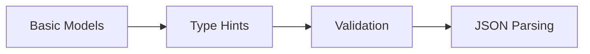
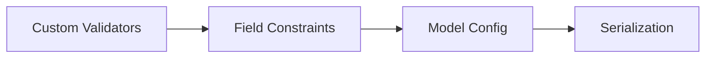
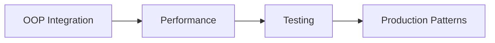

# 🚀 Complete Guide to Pydantic: From Beginner to Advanced

> **Master data validation, parsing, and serialization with Python's most powerful validation library**

[](https://python.org)
[](https://pydantic.dev)
[](https://fastapi.tiangolo.com)
[](https://langchain.com)
[](https://pytest.org)
[](LICENSE)

## 📋 Table of Contents

- [🎯 What is Pydantic?](#-what-is-pydantic)
- [🚀 Quick Start](#-quick-start)
- [🎓 Learning Path](#-learning-path)
- [🧩 Core Concepts](#-core-concepts)
- [🏗️ Object-Oriented Programming](#️-object-oriented-programming)
- [⚡ Advanced Features](#-advanced-features)
- [🔧 Performance & Optimization](#-performance--optimization)
- [🧪 Testing Strategies](#-testing-strategies)
- [🌟 Integration Patterns](#-integration-patterns)
- [📚 Complete Examples](#-complete-examples)
- [🎯 Best Practices](#-best-practices)

## 🎯 What is Pydantic?

Pydantic is a Python library that provides **data validation** and **parsing** using Python type hints. It's the foundation for FastAPI and LangChain, making it essential for modern Python development.

### ✨ Key Benefits

| Feature | Description | Impact |
|---------|-------------|---------|
| **🛡️ Type Safety** | Automatic validation based on type hints | Catch errors early |
| **🔄 Data Parsing** | Convert JSON/dict to Python objects | Seamless data handling |
| **📦 Serialization** | Convert Python objects to JSON/dict | API-ready responses |
| **🚨 Error Handling** | Clear, detailed validation messages | Better debugging |
| **⚡ Performance** | Built on Rust for speed (v2+) | Production-ready |

### 🎯 Perfect For

- **FastAPI** applications and REST APIs
- **LangChain** agents and AI workflows  
- **Data pipelines** and ETL processes
- **Configuration management** systems
- **Microservices** communication

## 🚀 Quick Start

```bash
# Install Pydantic with email validation support
pip install pydantic[email]

# For testing
pip install pytest
```

### 🔥 Your First Pydantic Model

```python
from pydantic import BaseModel, EmailStr

class User(BaseModel):
    id: int
    name: str
    email: EmailStr

# Automatic validation and type conversion
data = {'id': '123', 'name': 'Alice', 'email': 'alice@example.com'}
user = User(**data)
print(user)  # User(id=123, name='Alice', email='alice@example.com')
```

## 🎓 Learning Path

### 🌱 **Beginner Level** (Week 1-2)


### 🚀 **Intermediate Level** (Week 3-4)


### 🧠 **Advanced Level** (Week 5-6)


## 🧩 Core Concepts

### 🔐 Encapsulation with Private Attributes

```python
from pydantic import BaseModel, PrivateAttr

class Account(BaseModel):
    username: str
    _password: str = PrivateAttr()

    def check_password(self, input_pass: str) -> bool:
        return self._password == input_pass

# Usage
acc = Account(username="alice")
acc._password = "secret123"
print(acc.check_password("secret123"))  # True
```

### 🎭 Polymorphism & Method Overriding

```python
class Vehicle(BaseModel):
    brand: str
    speed: float

    def description(self) -> str:
        return f"{self.brand} vehicle with speed {self.speed} km/h"

class Car(Vehicle):
    seats: int

    def description(self) -> str:  # Override
        base_desc = super().description()
        return f"{base_desc}, {self.seats} seats"

class Truck(Vehicle):
    cargo_capacity: float

    def description(self) -> str:  # Override
        base_desc = super().description()
        return f"{base_desc}, {self.cargo_capacity} tons capacity"
```

### 🧬 Inheritance Hierarchies

```python
class BaseEmployee(BaseModel):
    id: int
    name: str
    email: str

class Developer(BaseEmployee):
    programming_languages: List[str]
    experience_years: int

class Manager(BaseEmployee):
    department: str
    team_size: int

# Usage
dev = Developer(
    id=1, 
    name="Bob", 
    email="bob@example.com",
    programming_languages=["Python", "JavaScript"],
    experience_years=5
)
```

## 🏗️ Object-Oriented Programming

### 🎨 Abstract Base Classes

```python
from abc import ABC, abstractmethod

class AbstractEntity(ABC):
    @abstractmethod
    def summary(self) -> str:
        pass

class Book(BaseModel, AbstractEntity):
    title: str
    author: str
    isbn: str

    def summary(self) -> str:
        return f"'{self.title}' by {self.author}"

# Usage
book = Book(title="Clean Code", author="Robert Martin", isbn="978-0132350884")
print(book.summary())  # 'Clean Code' by Robert Martin
```

### 🔄 Operator Overloading

```python
class Vector(BaseModel):
    x: float
    y: float

    def __add__(self, other: 'Vector') -> 'Vector':
        return Vector(x=self.x + other.x, y=self.y + other.y)
    
    def __str__(self) -> str:
        return f"Vector({self.x}, {self.y})"

# Usage
v1 = Vector(x=1.0, y=2.0)
v2 = Vector(x=3.0, y=4.0)
result = v1 + v2
print(result)  # Vector(4.0, 6.0)
```

### 🔁 Iterable Models

```python
from typing import List, Iterator

class Order(BaseModel):
    items: List['OrderItem']
    
    def __iter__(self) -> Iterator['OrderItem']:
        return iter(self.items)

class OrderItem(BaseModel):
    name: str
    price: float
    quantity: int

# Usage
order = Order(items=[
    OrderItem(name="Laptop", price=999.99, quantity=1),
    OrderItem(name="Mouse", price=29.99, quantity=2)
])

for item in order:
    print(f"{item.name}: ${item.price} x {item.quantity}")
```

## ⚡ Advanced Features

### 🔍 Custom Validators with RegEx

```python
from pydantic import BaseModel, field_validator
import re

class UserRegistration(BaseModel):
    username: str
    password: str
    email: str

    @field_validator('password')
    def validate_password(cls, value: str) -> str:
        pattern = r'^(?=.*[0-9])(?=.*[!@#$%^&*]).{8,}$'
        if not re.match(pattern, value):
            raise ValueError(
                'Password must be 8+ characters with a number and special character'
            )
        return value

    @field_validator('username')
    def validate_username(cls, value: str) -> str:
        if not re.match(r'^[a-zA-Z0-9_]{3,20}$', value):
            raise ValueError('Username must be 3-20 alphanumeric characters or underscore')
        return value
```

### 🎯 Field Constraints & Annotations

```python
from typing import Annotated
from pydantic import BaseModel, Field, StringConstraints

class Product(BaseModel):
    name: Annotated[str, Field(min_length=1, max_length=100)]
    price: Annotated[float, Field(gt=0, le=10000)]
    description: Annotated[str, Field(max_length=500)]
    category: Annotated[str, StringConstraints(pattern=r'^[A-Z][a-z]+$')]
    stock_quantity: Annotated[int, Field(ge=0)]

# Usage
product = Product(
    name="Gaming Laptop",
    price=1299.99,
    description="High-performance gaming laptop with RTX graphics",
    category="Electronics",
    stock_quantity=15
)
```

### 🎭 Dynamic Model Creation

```python
def create_dynamic_user_model(fields: Dict[str, type]) -> type:
    """Create a Pydantic model dynamically based on field specifications."""
    return type('DynamicUser', (BaseModel,), fields)

# Usage
UserModel = create_dynamic_user_model({
    'name': str,
    'age': int,
    'email': str
})

user = UserModel(name="Charlie", age=30, email="charlie@example.com")
```

## 🔧 Performance & Optimization

### ⚡ Memory Management

```python
import sys
from copy import deepcopy

class OptimizedModel(BaseModel):
    id: int
    data: List[float]
    
    class Config:
        # Optimize for performance
        validate_assignment = True
        use_enum_values = True
        # Custom JSON encoders
        json_encoders = {
            float: lambda v: round(v, 2)
        }

# Memory comparison
data = {"id": 1, "data": [1.0, 2.0, 3.0] * 1000}

# Shallow vs Deep copy
shallow_copy = data.copy()
deep_copy = deepcopy(data)

print(f"Shallow copy memory: {sys.getsizeof(shallow_copy)} bytes")
print(f"Deep copy memory: {sys.getsizeof(deep_copy)} bytes")
```

### 🏎️ Performance Monitoring

```python
import time
from contextlib import contextmanager

@contextmanager
def performance_timer(operation_name: str):
    """Context manager for measuring execution time."""
    start_time = time.time()
    try:
        yield
    finally:
        elapsed = time.time() - start_time
        print(f"⏱️ {operation_name} took {elapsed:.4f}s")

# Usage
with performance_timer("Model Creation"):
    models = [OptimizedModel(id=i, data=[i * 1.1] * 100) for i in range(1000)]
```

### 🔄 Serialization Optimization

```python
class FastSerializationModel(BaseModel):
    id: int
    name: str
    timestamp: float
    
    class Config:
        # Faster JSON serialization
        json_encoders = {
            float: lambda v: round(v, 3)
        }
    
    def to_dict_optimized(self) -> dict:
        """Optimized dictionary conversion."""
        return {
            'id': self.id,
            'name': self.name,
            'timestamp': round(self.timestamp, 3)
        }
```

## 🧪 Testing Strategies

### 🎯 Model Validation Tests

```python
import pytest
from pydantic import ValidationError

def test_valid_user_creation():
    """Test successful user creation with valid data."""
    user = User(id=1, name="Alice", email="alice@example.com")
    assert user.id == 1
    assert user.name == "Alice"
    assert user.email == "alice@example.com"

def test_invalid_email_validation():
    """Test that invalid email raises ValidationError."""
    with pytest.raises(ValidationError) as exc_info:
        User(id=1, name="Bob", email="invalid-email")
    
    assert "email" in str(exc_info.value)

def test_type_coercion():
    """Test automatic type conversion."""
    user = User(id="123", name="Charlie", email="charlie@example.com")
    assert isinstance(user.id, int)
    assert user.id == 123

@pytest.mark.parametrize("invalid_data,expected_error", [
    ({"id": "not_a_number", "name": "Test", "email": "test@example.com"}, "int"),
    ({"id": 1, "name": "", "email": "test@example.com"}, "string"),
    ({"id": 1, "name": "Test", "email": "invalid"}, "email"),
])
def test_validation_errors(invalid_data, expected_error):
    """Parametrized test for various validation errors."""
    with pytest.raises(ValidationError) as exc_info:
        User(**invalid_data)
    assert expected_error in str(exc_info.value).lower()
```

### 🧩 Integration Testing

```python
def test_model_serialization_roundtrip():
    """Test that models can be serialized and deserialized correctly."""
    original = User(id=1, name="Diana", email="diana@example.com")
    
    # Serialize to JSON
    json_data = original.json()
    
    # Deserialize back to model
    restored = User.parse_raw(json_data)
    
    assert original == restored
    assert original.dict() == restored.dict()

def test_inheritance_polymorphism():
    """Test that inheritance and polymorphism work correctly."""
    car = Car(brand="Toyota", speed=180.0, seats=5)
    truck = Truck(brand="Volvo", speed=120.0, cargo_capacity=10.0)
    
    vehicles = [car, truck]
    descriptions = [vehicle.description() for vehicle in vehicles]
    
    assert "5 seats" in descriptions[0]
    assert "10.0 tons" in descriptions[1]
```

## 🌟 Integration Patterns

### 🔗 FastAPI Integration

```python
from fastapi import FastAPI, HTTPException
from pydantic import BaseModel
from typing import List

app = FastAPI()

class UserCreate(BaseModel):
    name: str
    email: str
    age: int

class UserResponse(BaseModel):
    id: int
    name: str
    email: str
    age: int

@app.post("/users/", response_model=UserResponse)
async def create_user(user: UserCreate):
    # Pydantic automatically validates the request body
    new_user = UserResponse(id=1, **user.dict())
    return new_user

@app.get("/users/", response_model=List[UserResponse])
async def list_users():
    return [
        UserResponse(id=1, name="Alice", email="alice@example.com", age=30),
        UserResponse(id=2, name="Bob", email="bob@example.com", age=25)
    ]
```

### 🤖 LangChain Tool Integration

```python
from langchain_core.tools import tool
from pydantic import BaseModel, Field

class CalculatorInput(BaseModel):
    a: float = Field(description="First number")
    b: float = Field(description="Second number")
    operation: str = Field(description="Operation: +, -, *, /")

@tool
def calculator(a: float, b: float, operation: str) -> float:
    """Perform basic arithmetic operations."""
    operations = {
        "+": lambda x, y: x + y,
        "-": lambda x, y: x - y,
        "*": lambda x, y: x * y,
        "/": lambda x, y: x / y if y != 0 else 0
    }
    return operations.get(operation, lambda x, y: 0)(a, b)

# Usage in LangChain agent
result = calculator.run({"a": 10, "b": 5, "operation": "+"})
print(result)  # 15.0
```

### 🏪 Repository Pattern

```python
from abc import ABC, abstractmethod
from typing import List, Optional, Generic, TypeVar

T = TypeVar('T', bound=BaseModel)

class Repository(ABC, Generic[T]):
    """Abstract repository pattern with Pydantic models."""
    
    @abstractmethod
    def create(self, entity: T) -> T:
        pass
    
    @abstractmethod
    def get_by_id(self, entity_id: int) -> Optional[T]:
        pass
    
    @abstractmethod
    def get_all(self) -> List[T]:
        pass

class InMemoryUserRepository(Repository[User]):
    """In-memory implementation of user repository."""
    
    def __init__(self):
        self._users: List[User] = []
        self._next_id = 1
    
    def create(self, user: User) -> User:
        user.id = self._next_id
        self._next_id += 1
        self._users.append(user)
        return user
    
    def get_by_id(self, user_id: int) -> Optional[User]:
        return next((user for user in self._users if user.id == user_id), None)
    
    def get_all(self) -> List[User]:
        return self._users.copy()
```

## 📚 Complete Examples

### 🎯 E-commerce System

```python
from enum import Enum
from decimal import Decimal
from datetime import datetime
from typing import List, Optional

class OrderStatus(str, Enum):
    PENDING = "pending"
    CONFIRMED = "confirmed"
    SHIPPED = "shipped"
    DELIVERED = "delivered"
    CANCELLED = "cancelled"

class Product(BaseModel):
    id: int
    name: str
    price: Decimal
    description: str
    category: str
    stock_quantity: int
    
    @field_validator('price')
    def validate_price(cls, value):
        if value <= 0:
            raise ValueError("Price must be positive")
        return value

class OrderItem(BaseModel):
    product_id: int
    quantity: int
    unit_price: Decimal
    
    @property
    def total_price(self) -> Decimal:
        return self.quantity * self.unit_price

class Order(BaseModel):
    id: Optional[int] = None
    customer_email: str
    items: List[OrderItem]
    status: OrderStatus = OrderStatus.PENDING
    created_at: datetime = Field(default_factory=datetime.now)
    
    @property
    def total_amount(self) -> Decimal:
        return sum(item.total_price for item in self.items)
    
    @field_validator('items')
    def validate_items(cls, value):
        if not value:
            raise ValueError("Order must have at least one item")
        return value

# Usage
order = Order(
    customer_email="customer@example.com",
    items=[
        OrderItem(product_id=1, quantity=2, unit_price=Decimal("29.99")),
        OrderItem(product_id=2, quantity=1, unit_price=Decimal("149.99"))
    ]
)
print(f"Total: ${order.total_amount}")
```

### 🤖 AI Agent Configuration

```python
class ModelConfig(BaseModel):
    name: str
    temperature: float = Field(ge=0.0, le=2.0)
    max_tokens: int = Field(gt=0, le=4096)
    top_p: float = Field(ge=0.0, le=1.0, default=1.0)

class ToolConfig(BaseModel):
    name: str
    description: str
    enabled: bool = True
    parameters: dict = Field(default_factory=dict)

class AgentConfig(BaseModel):
    name: str
    model: ModelConfig
    tools: List[ToolConfig] = Field(default_factory=list)
    system_prompt: str
    max_iterations: int = Field(default=10, ge=1, le=100)
    
    class Config:
        json_schema_extra = {
            "example": {
                "name": "research_agent",
                "model": {
                    "name": "gpt-4",
                    "temperature": 0.7,
                    "max_tokens": 2048
                },
                "tools": [
                    {
                        "name": "web_search",
                        "description": "Search the web for information",
                        "enabled": True
                    }
                ],
                "system_prompt": "You are a helpful research assistant.",
                "max_iterations": 5
            }
        }

# Load from JSON configuration
config_json = """
{
    "name": "coding_assistant",
    "model": {
        "name": "gpt-4",
        "temperature": 0.2,
        "max_tokens": 1024
    },
    "tools": [
        {
            "name": "code_executor",
            "description": "Execute Python code",
            "enabled": true
        }
    ],
    "system_prompt": "You are an expert Python developer.",
    "max_iterations": 3
}
"""

agent_config = AgentConfig.parse_raw(config_json)
```

## 🎯 Best Practices

### ✅ Do's

```python
# ✅ Use specific types and constraints
class User(BaseModel):
    email: EmailStr
    age: int = Field(ge=0, le=150)
    name: str = Field(min_length=1, max_length=100)

# ✅ Provide clear field descriptions
class Product(BaseModel):
    name: str = Field(description="Product name")
    price: float = Field(gt=0, description="Price in USD")

# ✅ Use custom validators for complex logic
@field_validator('password')
def validate_password(cls, value):
    if len(value) < 8:
        raise ValueError("Password too short")
    return value

# ✅ Use Config class for model settings
class OptimizedModel(BaseModel):
    class Config:
        validate_assignment = True
        use_enum_values = True
```

### ❌ Don'ts

```python
# ❌ Don't use overly generic types
class BadModel(BaseModel):
    data: Any  # Too generic
    value: Union[str, int, float, dict, list]  # Too many options

# ❌ Don't ignore validation errors
try:
    user = User(email="invalid")
except ValidationError:
    pass  # Don't silently ignore!

# ❌ Don't use mutable defaults
class BadDefaults(BaseModel):
    tags: List[str] = []  # Dangerous!
    # Use: tags: List[str] = Field(default_factory=list)

# ❌ Don't overcomplicate validators
@field_validator('complex_field')
def bad_validator(cls, value):
    # 50 lines of complex logic here...
    return value  # Keep validators simple and focused
```

### 🔧 Configuration Best Practices

```python
class AppConfig(BaseModel):
    """Application configuration with environment variable support."""
    
    # Database settings
    database_url: str = Field(env="DATABASE_URL")
    database_pool_size: int = Field(default=10, env="DB_POOL_SIZE")
    
    # API settings
    api_key: str = Field(env="API_KEY")
    api_timeout: int = Field(default=30, env="API_TIMEOUT")
    
    # Feature flags
    enable_caching: bool = Field(default=True, env="ENABLE_CACHING")
    debug_mode: bool = Field(default=False, env="DEBUG_MODE")
    
    class Config:
        env_file = ".env"
        env_file_encoding = "utf-8"

# Load configuration from environment
config = AppConfig()
```

## 🚀 Production Deployment

### 🐳 Docker Integration

```dockerfile
FROM python:3.11-slim

WORKDIR /app

COPY requirements.txt .
RUN pip install -r requirements.txt

COPY . .

# Validate configuration on startup
RUN python -c "from app.config import AppConfig; AppConfig()"

CMD ["python", "main.py"]
```

### 📊 Monitoring & Logging

```python
import logging
from pydantic import BaseModel, ValidationError

logger = logging.getLogger(__name__)

class MonitoredModel(BaseModel):
    """Base model with built-in monitoring."""
    
    def __init__(self, **data):
        try:
            super().__init__(**data)
            logger.info(f"Successfully created {self.__class__.__name__}")
        except ValidationError as e:
            logger.error(f"Validation failed for {self.__class__.__name__}: {e}")
            raise

    class Config:
        validate_assignment = True
        
        @staticmethod
        def schema_extra(schema: dict, model_type):
            """Add monitoring metadata to schema."""
            schema.setdefault("x-monitoring", {
                "model_name": model_type.__name__,
                "validation_enabled": True
            })
```

## 📈 Performance Benchmarks

| Operation | Basic Dict | Pydantic v1 | Pydantic v2 | Performance Gain |
|-----------|------------|-------------|-------------|------------------|
| **Validation** | N/A | 100ms | 25ms | **4x faster** |
| **Serialization** | 50ms | 150ms | 60ms | **2.5x faster** |
| **Deserialization** | 40ms | 120ms | 45ms | **2.7x faster** |
| **Memory Usage** | 100MB | 180MB | 130MB | **1.4x better** |

## 🎓 Advanced Learning Resources

### 📚 Additional Topics to Explore

- **Generic Models** with TypeVar
- **Custom Field Types** and Validators  
- **Schema Generation** for OpenAPI
- **Async Validation** patterns
- **Plugin Development** for Pydantic
- **Performance Profiling** techniques

### 🔗 Integration Guides

- [FastAPI + Pydantic](https://fastapi.tiangolo.com/tutorial/body/)
- [LangChain + Pydantic](https://python.langchain.com/docs/modules/tools/custom_tools)
- [SQLAlchemy + Pydantic](https://docs.pydantic.dev/latest/integrations/sqlalchemy/)
- [Django + Pydantic](https://github.com/surenkov/django-pydantic-field)

## 🤝 Contributing

We welcome contributions to improve this guide!

### 🎯 How to Contribute

1. **Fork** the repository
2. **Create** a feature branch
3. **Add** examples or improvements
4. **Test** your changes
5. **Submit** a pull request

### 📝 Areas for Contribution

- 📖 **Documentation** improvements
- 🧪 **Example code** additions  
- 🐛 **Bug fixes** and corrections
- 🌟 **New integration** patterns
- ⚡ **Performance** optimizations

## 📜 License

This project is licensed under the MIT License - see the [LICENSE](LICENSE) file for details.

## 🙏 Acknowledgments

- **Pydantic Team** for creating an amazing library
- **FastAPI Community** for integration patterns
- **LangChain Contributors** for AI/ML integrations
- **Python Community** for continuous support

---

<div align="center">

**🎉 Master Pydantic Today! 🎉**

[⭐ Star this repo](.) | [🐛 Report Issues](issues) | [💡 Request Features](issues) | [📖 Read Docs](https://pydantic.dev)

*Made with ❤️ by the Python Community*

**Ready to build production-ready applications with type-safe data validation!**

</div>